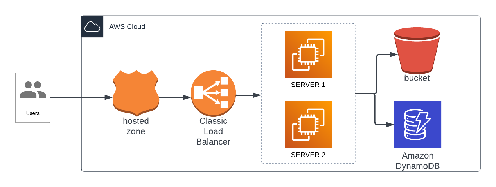

# DevOps: Terraform Course

This course is sample work through of [terraform up and running](https://www.terraformupandrunning.com/)

## Architecture

We will be using the below architecture as sample project throughout the course

## 02 - Overview + Setup

## Install Terraform

Official installation instructions from HashiCorp: https://learn.hashicorp.com/tutorials/terraform/install-cli

## AWS Account Setup

AWS Terraform provider documentation: https://registry.terraform.io/providers/hashicorp/aws/latest/docs#authentication

1. create non-root AWS user
2. Add the necessary IAM roles (e.g. AmazonEC2FullAccess)
3. Save Access key + secret key (or use AWS CLI `aws configure` -- https://docs.aws.amazon.com/cli/latest/userguide/install-cliv2.html)

## Boostrap command

`./main.tf` contains minimal configuration to provision an EC2 instance.

1. `aws configure`
2. `terraform init`
3. `terraform plan`
4. `terraform apply`
5. `terraform destroy`

## Projects

<!-- ### 01 - Evolution of Cloud + Infrastructure as Code

High level overview of the evolution of cloud computing and infrastructure as code.

This module does not have any corresponding code.

### 02 - Overview + Setup

Terraform overview and setup instructions.

Includes basic `hello world` terraform config to provision a single AWS EC2 instance. -->

### 01 - Backed

Setting up remote backends (where the terraform state is stored) using terraform Cloud and AWS, and provides a naive implementation of a web application architecture.

### 04 - Variables and Outputs

Introduces the concepts of variables which enable Terraform configurations to be flexible and composable. Refactors web application to use these features.

### 05 - Language Features

Describes additional features of the Hashicorp Configuration Language (HCL).

### 06 - Organization and Modules -->

<!-- Demonstrates how to structure terraform code into reuseable modules and how to instantiate/configure modules.

### 07 - Managing Multiple Environments

Shows two methods for managing multiple environments (e.g. dev/staging/prodution) with Terraform.

### 08 - Testing

Explains different types of testing (manual + automated) for Terraform modules and configurations.

### 09 - Developer Workflows + CI/CD

Covers how teams can work together with Terraform and how to set up CI/CD pipelines to keep infrastructure environments up to date.
